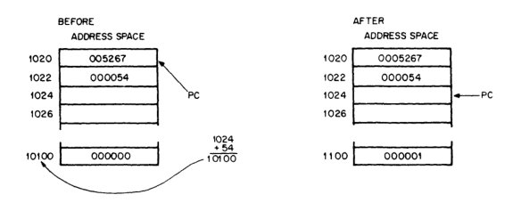

# PDP-11 Notes

Some notes for the next COMS2223 "quiz".

## PDP-11 Traits

Here are some features of the PDP-11/40 (since there are various PDP-11, this
the 11/40 is the one focused on in class)
+ It used a 16-bit word size (two 8-bit bytes). Had direct addressing of 32K
  16-bit words or 64K 8-bit words. (K = 1024)
+ Word or byte processing very efficient handling of 8-bit characters
+ Asynchronous operations: systems run at their highest possible speeds
+ Stack processing: hardware sequential memory manipulation made it easy to
  handle structured data, subroutines, and interrupts.
+ Had 8 GPR that were very fast (remember which register is what)
  + Registeres R0-R5 are the GPR (General Purpose Registers)
  + Register R6 is the Stack pointer
  + Register R7 is the PC (program counter)
+ Vectored interrupts: fast interrupts without device polling
+ Single and doubled operand instructions: powerful and convenient set of
  micro-programmed instructions

## PDP-11 ISA
The basic order code of the PDP-11 uses both single and double operand address
instructions.

## Octal Representation
The 16-bit PDP-11 word can be represented as a 6-digit octal word.

This is how the 16-bit word usually looks like, but we can group it and convert
the binary digits into octal. The MSB of the 16-bit word also becomes the MSB
digit of the 6-digit octal word.

```
[,,15] [14,13,12] [11,10,9] [8,7,6] [5,4,3] [2,1,0]
```

```
MOV   R5,     (R4)             
1  000 101  001 100
     ^       ^ indirection bit
     | indirection bit

[0] [001] [000] [101] [001] [100]
 0     1     0     5     1     4

  which is a 6-digit octal word: 010514
  or "move contents of register 5 into register 4"

00x - Register
01x - Auto (post)increment
10x - Auto (post)decrement
11x - Indexed
```

In the above, we talked about indirection bits. Notice that they are the LSB of
the grouping of bits. When the indirection bit is 1, the addressing mode is in
indirection (AKA deferred) mode. The the bit is 0, the addressing mode is
direct addressing.

### Converting MISC

We can convert from Binary to Octal, as shown above. To convert binary to
hexadecimal, we can convert it to its octal form. After converting it to octal
form, DROP all leading 0s (not following) and group it into groups of 4.

```
        3   4   5     Decimal
      011 100 101     Binary
      
      0111 0101       Group the binary digits into groups of 4
      1110  101       remove leading 0s and group into 4
      1110 0101       Pad in the 0s where they are need for groups of 4
         E    5       Hexadecimal
```

### 10-bit 2's Complement

To convert a positive decimal number to 10-bit 2's complement:
1. Simply convert the decimal to binary (there exists a range we can only
   support with n-bits)
2. Pad the number with 0s as MSB if needed to satisfy the 10-bit.

To convert a negative decimal number to 10-bit 2's:
1. Convert the decimal number to binary.
2. Pad the number with 0s as MSB if needed.
3. "Flip" the bits.
4. Add 1 to the binary value after flipping the bits.

## Processor Status Word

The Processor Status Word (PSW) is located at location 777776 (not that that
will be of any relevance). This contains the information on the PDP-11/40.


#### Modes
Bits 15 and 14 are the current mode for the Stack Pointer(either user or kernel
mode). Bits 13 and 12 represent the previous modes, and bits 11 through 8
aren't used (maybe).

When the program operates in User Mode, the program isn't allowed to execute a
"HALT" instruction and the processor will trap through location 10 if an
attempt is made to execute a "HALT" instruction. 

Programs operating in Kernal mode can map users' programs anywhere in core and
explicitly protect key areas from User operating environment.

#### Processor Priority

Bits 7 through 5 are the processor priority bits. If the CPU operates at a high
priority level, external devices are not allowed to interrupt it with service
requests. The higher the bit that the CPU is working on, the harder it is to
require service. Therefore, operating at lower bits will likely allow for
interrupts.

#### Conditional Codes

The conditional codes are labeled as such:
**N  Z  V  C**

```
N - 1 if last result was negative

Z - 1 if the result was zero.

V - 1 if generated a 2's complement overflow

C - 1 if had to carry from the MSB
```

### Trap Bit

The trap bit (T) when set will load a new PSW. This bit is useful for debugging
programs because you can install breakpoints with it.

## PDP-11 Addressing Modes

Data stored in memory must be access and manipulated. Handling data is
specified by the PDP-11 ISA (Instruction Set Architecture). These include
`MOV`, `ADD`, and many more.

In the PDP-11, any of the GPR can be used as a stack pointer.

GPR may be used with an instruction in any of the follow ways:
+ Accumlators: data the be manipulated will stay within register
+ Pointers: The contents of the register are the address of the operand rather
  than the operand itself
+ Auto pointers: pointers that can step forward or backward in core locations.
  This is also known as autoincrement addressing (forward) and autodecrement
  addressing (backward) and are extremely useful for going through tabular data
  (sequential data in memory)
+ Index registers: contents of the register and the word following the
  instruction are summed to produce the address of the operand.
  (`.begin()+5` maybe?)

### Single Operand Addressing
Examples of a single operand instruction is `CLR`, `INC`, and `TST`. (Clear,
Increment, Test).


The 16-bit word size from above.
+ Bits 15 through 6 specify the op-code (operation code). The op-code defined
  the type of instruction to be executed.
+ Bits 5 throuh 0 form a six-bit field. This is called the destination address
  field **and contains two subfields**.
  1. Bits 0 through 2 specify who of the eight GPR is to be reference by the
     instruction word.
  2. Bits 3 through 5 specify how the selected register will be used
     (address-mode). **Bit 3 indicated direct or indirect addressing**.
     (Indirect addressing is also known as deferred addressing).

#### High and Low Byte

The PDP-11 word is divided into a high byte and a low byte.


+ Low bytes are stored at **even-numbered** memory locations
+ High bytes are stored at **odd-numbered** memory locations

### Double Operand Addressing

These are operations which imply **two operands** and are handled by
instructions that specify two addresses.


**Two Operands:**
1. Source Operand
2. Destination Operand

The insturction format for the double operand instruction is:
+ Bits 15 through 12 and used for the op-code.
+ Bits 11 through 6 are used for source address. This source address is then
  used to locate the first operand.
+ Bits 5 through 0 are used for the destination address. Similarly, the
  destination address is then used to find the second operand. The manual gives
  the example of `ADD A, B` which means add the contents of the sources A to
  the contents of B. A will be unchanged after the execution, but register B
  will contain the the addition and contents of A.

## Direct Addressing

There are four basic modes with direct addressing

```
Mode   Name              Assember Syntax        Function
 0     Register              Rn                 Register contains operand

 2     Autoincrement        (Rn)+               Register is used as a pointer
                                                to sequential data, then is
                                                incremented

 4     Autodecrement       -(Rn)                Register is decremented and
                                                then used as a pointer

 6     Index               X(Rn)                Value X is added to (Rn) to
                                                produce an address of an
                                                operand. Neither X nor (Rn) are
                                                modified
```

### Register Mode

With this mode, any of the GPR may be used as simple accumulators. The operand
is contained in the selected register. Since they are hardware register, the
GPRs that use this mode will operate at high speeds. Assember syntax requires
that a general register be defined as follows (% sign indicated register
definition):

```
R0 = %0
R1 = %1
R2 = %2
...
```

#### Register Mode Examples
```
INC   R3       ; Add one to the contents of the general register 3
ADD   R2,R4    ; Add contents of R2 to R4, but do not change R2
COMB  R4       ; Complement byte of R4 (idk how this works)
```

### Auto Increment Mode

This mode provides automatic stepping of a pointer through sequential data
(tabular data). It assumes the contects of the GPR to be the address of the
operand. Contents of registers are stepped by one byte for byte instructions
and two bytes for word instructions to address the next sequential data. It's
powerful use especially for array processing and stacks.

```
CLR(R5)+       ; Use contents of R5 as address of operand. Clear selected
               ; operand and then increment contents of R5 by two.

CLRB(R5)+      ; Use contents of R5 as address of operand. Clear selected byte
               ; operand and then increment contents of R5 by one.
```

### Auto Decrement Mode

Mode is useful for processing data in a list in the reverse direction. Contents
of the selected general register are decremented by two for word instructions
and one for byte instructions and THEN they are used for the address of the
operand.

```
INC  -(R0)    ; Decrease the value in R0 by two and then use it as the address
              ; of the operand. Then increase the operand by 1.

INCB -(R0)    ; Decrease the value in R0 by one and then use it as the address
              ; of the operand. Then increase the operand byte by 1.
```

### Index Mode

In this mode, the contents of the selected general register and an index word
following the instruction word are summed to form the address of the operand.
From above, where X is the indexed word and Rn is the selected register.

```
CLR  200(R4)   ; Add 200 with contents of R4 and use that as the address of the
               ; operand. Clear the contents of that address.
```

## Indirect Addressing

This is also known as **deferred addressing**. There are four basic modes with
this type of addressing.

```
Mode   Name                     Assember Syntax     Function
 1     Register Deferred        @Rn or (Rn)         Register contains the
                                                    address of the operand

 3     Autoincrement Deferred   @(Rn)+              Register is first used as a
                                                    pointer to a word container
                                                    the address of the operand,
                                                    then incremented by 2, even
                                                    for byte instructions

 5     Autodecrement Deferred   @-(Rn)              Register is decremented by
                                                    two even for byte
                                                    instructions and then used
                                                    as a pointer to a word
                                                    containing the address of
                                                    the operand.

 7     Index Deferred           @X(Rn)              Value X (stored in a word
                                                    following the instruction)
                                                    and (Rn) are added. The sum
                                                    is then used as a pointer
                                                    to a word container the
                                                    address of the operand.
                                                    Neither X nor (Rn) are
                                                    modified.
```

**Each deferred mode is very similar to its basic counterpart.**

### Register Deferred Mode

Take the following (from the manual) as an example: `CLR @R5`. This will use
the contents of register 5 as the address of the operand and clear that
address. That's all. It's almost the same as the direct address mode
counterpart, but instead of modifying R5, we use its contents as the address
operand.

Take for example this PDP-11/40 code.
```
start:
  mov #100,100   ; addr 100 has 100
  mov #100,r0    ; r0 has value 100
  clr @(r0)      ; since r0 has 100, clear addr 100 (not r0)
  mov 100,r0     ; r0 is now 0
.end start
```

### Autoincrement Deffered Mode

Consider the following: `INC @(R2)+`


This is similar to a pointer to pointer. We will use the contents of R2 as a
source operand, **but** whichever value that pointer points to will actually be
be the value we increment.
1. R2 contains 10300, so we use 10300 as our address operand.
2. We get to 10300 and its contents are 1010, so we now use 1010 as our source
   operand (think pointer to pointer)
3. Now increment the contents in 1010, which is 25, to 26
4. Increment R2's contents by 2 (regardless if it's a word instruction or a
   byte instruction).

### Autodecrement Deferred Mode

Let's consider `COM @-(R0)`, which means
+ Use the contents of the R0 as the address operand and go to it
+ Once there, use the content of R0's content minus 2 as the next address
  operand
+ Now we get to address that address, complement it as follows

  ```
  012345                     ; The octal representation
  000 001 010 011 100 101    ; represent each digit into binary (padded 0)
  111 110 101 100 011 010    ; invert the bits
  111 110 101 100 011 010    ; add 1 to MSB (will cause overflow so need carry)
  000 110 101 100 011 010    ; MSB is set to 000
  001 110 101 100 011 010    ; add the carry-in to the MSB
    1   6   5   4   3   2    ; convert to octal again
  ```
+ Now R0 is decremented by 2 (regardless of whether it's a word instruction or
  a byte instruction).


### Index Deferred Mode

Consider `ADD @1000((R2),R1`, which translates to:
+ Take the pointer to pointer of R2 and add it 1000
+ Grab that value at that pointer value
+ Add it to R1


## Using PC (R7) as a GPR

We can also use the PC register as a GPR. When processor uses program counter
to acquire a word from memory, it is automatically incremented by 2 to contain
the address of the next word (same with byte) of the instruction being executed
or address or next instruction.

```
Mode  Name                 Assembler Syntax      Function
 2    Immediate            #n                    Operand follows instruction

 3    Absolute             @#A                   Absolute address follows
                                                 instruction

 6    Relative             A                     Relative address (index value)
                                                 follows the instruction

 7    Relative Deferred    @A                    Index valued (stored in word
                                                 following instruction) is
                                                 relative address for the
                                                 address of operand.
```

### PC as GPR (Immediate Addressing)
`ADD #10,R0` will add the value 10 to register 0. This one is very easy.


### PC as GPR (Absolute Addressing)

`CLR @#1100` will clear the contents at memory location 1100.


### PC as GPR (Relative Addressing)

This mode is assembled as index mode using the PC register (R7). The base of
the address, which stored in the second or third word of the instruction, is
added to the PC and then becomes the address of the operand. When the
instruction are to be relocated, the operand is moved by the same amount.
Basically, we look at the current PC and add it's adjacant contents to it and
use it as the address of the operand.



1. The current PC is at 005267
2. The grab the contents of the of PC+2 and add the contents of that to the
   address of address next to PC+2 (essentially just something like PC+2 +2)
3. The PC is increased by 4

### PC as GPR (Relative Deferred Addressing)

1. It's almost the same steps as above, but with the similar idea of pointer to
   pointer.
2. For some reason, PC is unchanged?


## Instruction Formats

Taken directly from the manual


## Byte Instructions

The MSB (bit 15) of the instruction word is set to indicate a byte instruction
(not word instruction).


For example, let's a look at `CLR`.

```
CLR
0050DD                    ; Octal code
000 000 101 000 DDD DDD   ; Representation in binary
```

And, if mentioned above, we wanted to preform a byte instruction, we would
simple modify the MSB (bit 15)

```
CLRB
0050DD                    ; Octal code

0 000 101 000 xxx xxx

001 000 101 000 DDD DDD   ; Representation in binary (MSB is set)
```

Let's analyze the word instruction from Week05.md

```
Octal Code: 010514       ; Notice how the MSB for the octal is 0
                         ; This means when translated to binary, MSB is also
                         ; zero there this is going to be a word instruction
010514
000 001 000 101 001 100  ; We never actually use the first 2-bits, because we
                         ; are only limited to 15-bits

0 001 000 101 001 100    ; We can just remove the first two bits and make it
                         ; 15-bits (remember the MSB here indicated if it's a
                         ; word instruction or a byte instruction)

      SSS SSS DDD DDD    ; First two sets of bits are the source and the second
0 001 000 101 001 100    ; set of bits are the destination.
                         ; In this case, we are moving 101 (R5) to 100 (R4)
                         ; And since the indirection bit for the destination
                         ; field is 001, we will post autoincrement.

start:
  mov #100,r5
  mov r5,(r4)+           ; Can you guess what value the operand is in r4?
                         ; Where did we move r5 to?
.end start
```

### List of Common Instructions

You can get more from the manual

```
Let x represent 0/1 with 0 = word instruction
                         1 = byte instruction
    r represent register

OP CODE     SYNTAX      DESCRIPTION                TYPE

x1SSDD      MOV(B)      Move SS to DD              Double Operand
x2SSDD      CMP(B)      Compare SS to DD           Double Operand
x3SSDD      BIT(B)      Bit test                   Double Operand
x4SSDD      BIC(B)      Bit clear                  Double Operand
x5SSDD      BIS(B)      Bit set                    Double Operand
06SSDD      ADD         Add from SS to DD
16SSDD      SUB         Subtract SS from DD


x050DD      CLR(B)      Clear contents of DD       Single Operand
x051DD      COM(B)      Complement DD              Single Operand
x052DD      INC(B)      Increment contents of DD   Single Operand
x053DD      DEC(B)      Decrement contents of DD   Single Operand
x054DD      NEG(B)      Negate contents of DD      Single Operand
x057DD      TST(B)      Test DD                    Single Operand
```

## Use of Stack Pointer as GPR

Stack pointer (R6) is, in most cases, the general register use when dealing
with stack operations. Autodecrement with the SP pushed data onto the stack and
autoincrement with SP pops data off the stack. SP allows for random access of
items on the stack. It is also used by the processor for interrupt handling.
It has a special attribute: auto autoincrement and autodecrements are always
done in steps of two.  Byte operations using the SP in this way leave odd
addresses unmodified.

With the Memory Management option, there are two SP registers selected by the
Program Stack, but at any given time, only one is operation.

## Stacks in the PDP-11

A stack in the PDP-11 is a temporary data storage area which allow programs to
make efficient use of frequently accessed data. It is automatically used by
program interrupts, subroutine calls, and trap instructions. Stacks in the
PDP-11 uses the concepts in last-in-first-out.

When the processor is interrupted, the central PSW and the PC are saved (pushed
onto the stack area) while the processor services the interrupting device. A
new Status word is then automatically acquired from an area in core memory
which is reserved for interrupted instructions (vector area). Returns from
interrupt instruction will restore the original PSW and returns to the
interrupted program without software intervention.

As mentioned, there exists two Stack Pointer registers in he PDP-11/40 (Kernal
and User). Refer to the **mode** heading above.


Notice how there is the Kernel Stack Pointer and the User Stack Pointer.

### The Stack Pointer (adding items to stack)

Stacks operate on high-low memory, meaning that it starts from the highest
location reserved for it and expands linearly downward to the lower addresses
as items are added onto the stack. The stack pointer will also keep track of
these items.


```
MOV  SS,~(SP)    ; Moves a souce word onto the stack. This is "pushing" items
                 ; onto the stack.

MOVB SS,~(SP)    ; Moves a source byte onto the stack. This is "pushing" items
                 ; onto the stack

MOV  (SP)+,DD    ; Move destination word off the stack. This is "popping" items
                 ; off of the stack.

MOVB (SP)+,DD    ; Move a destination byte off of the stack.
```

## Subroutine Linkage

PDP-11 subroutines are called by using the `JSR` instruction and has the
format:

```
Rn   = some register that will be used for linkage
SUBR = an entry location for the subroutine

JSR Rn,SUBR
```

When JSR is executed, contents of the linkage register's contents are saved
onto the SP and then the same register is loaded with the memory address
solloing the JSR instruction. (The manual states it "is as if " push to stack
was performed. There is no explicit definition of what exactly happens.)


